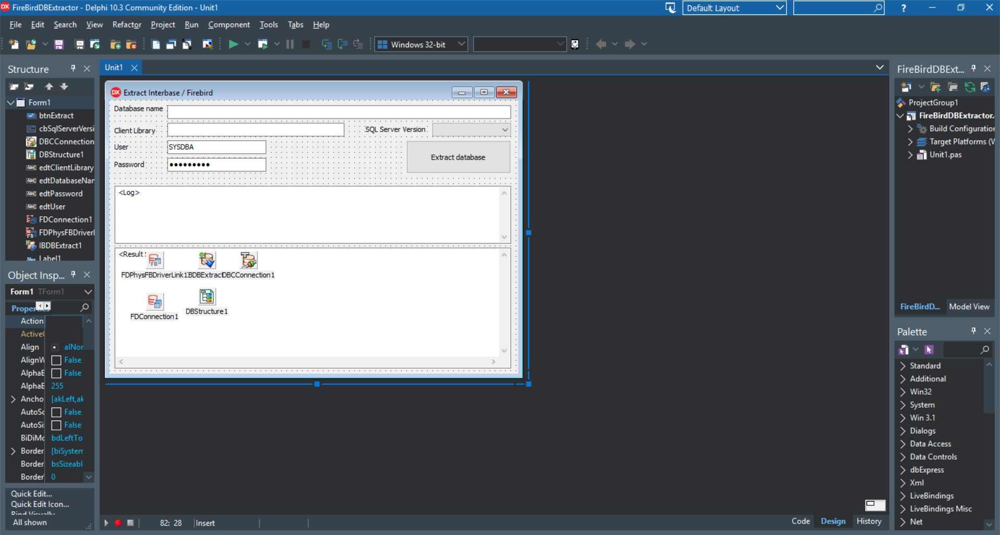

# Extract DB structure, Firebird+FireDAC

The Extract DB structure, Firebird+FireDAC project represents a code example for the [Extract DB structure, Firebird+FireDAC](https://www.clevercomponents.com/portal/kb/a136/sftp-client-with-user-and-public-key-authorization.aspx) tutorial.   

This example shows how to extract a FireBird database structure via the FireDAC library.

The [GitHub/CleverComponents/Clever-Internet-Suite-Tutorials](https://github.com/CleverComponents/Clever-Internet-Suite-Tutorials) repository represents a list of examples, code snippets and demo projects for the [Clever Internet Suite Tutorials](https://www.clevercomponents.com/articles/article035/) article. This list will be periodically updated, new projects will be added.   
Please stay tuned to new examples and use cases of the [Clever Internet Suite](https://www.clevercomponents.com/products/inetsuite/) library.
