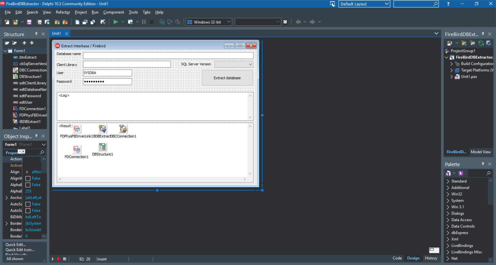

# Extract DB structure, Firebird+FireDAC

The Extract DB structure, Firebird+FireDAC project represents a code example for the [Extract DB structure, Firebird+FireDAC](https://www.clevercomponents.com/portal/kb/a146/extract-db-structure-firebirdfiredac.aspx) tutorial.   

This example shows how to extract a FireBird database structure via the FireDAC library.

The [GitHub/CleverComponents/Database-Comparer-Tutorials](https://github.com/CleverComponents/Database-Comparer-Tutorials) repository represents a list of examples, code snippets and demo projects for the [Database-Comparer-Tutorials](https://www.clevercomponents.com/portal/kb/c12/tutorials.aspx) article. This list will be periodically updated, new projects will be added.   
Please stay tuned to new examples and use cases of the [Database Comparer](https://www.clevercomponents.com/products/dbc.asp) library.
