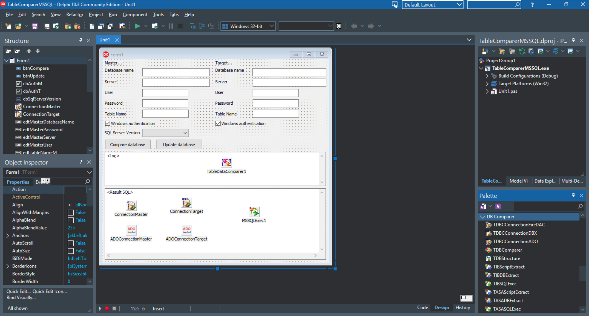

# Synchronize MS SQL database tables via ADO

The Synchronize MSSQL database tables via ADO project represents a code example for the [Synchronize MS SQL database tables via ADO](https://www.clevercomponents.com/portal/kb/a148/synchronize-firebird-db-structures-via-firedac.aspx) tutorial.   

This example shows how to synchronize a MSSQL database tables via  ADO.

The [GitHub/CleverComponents/Database-Comparer-Tutorials](https://github.com/CleverComponents/Database-Comparer-Tutorials) repository represents a list of examples, code snippets and demo projects for the [Database-Comparer-Tutorials](https://www.clevercomponents.com/portal/kb/c12/tutorials.aspx) article. This list will be periodically updated, new projects will be added.   
Please stay tuned to new examples and use cases of the [Database Comparer](https://www.clevercomponents.com/products/dbc.asp) library.
